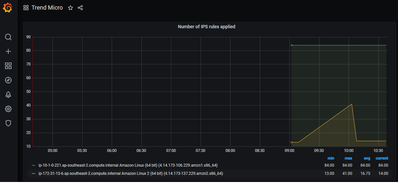
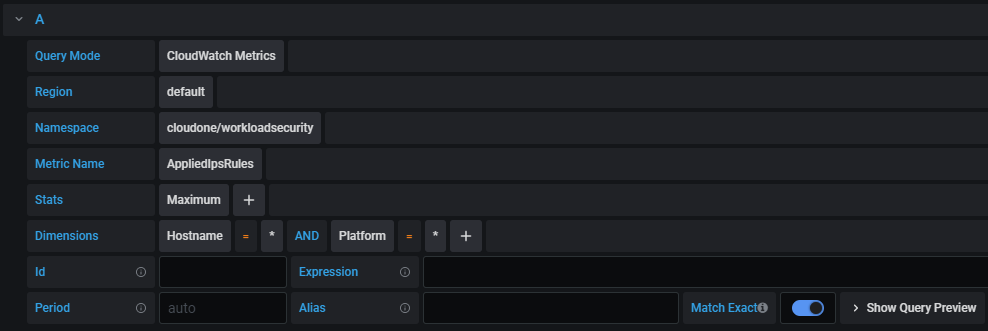

# Workload Security IPS Graph

Using CloudWatch Metrics, graph the number of Workload Security IPS rules applied to hosts.



## Usage instructions

1. Install the required libraries:

```
pip install -r requirements.txt
```
 
2. Start a Grafana container:
```
docker run -d -p 3000:3000 --name grafana grafana/grafana
```

3. Create an [IAM policy](https://grafana.com/docs/grafana/latest/features/datasources/cloudwatch/#iam-roles) for Grafana.

4. Log into Grafana's UI. Set CloudWatch up as a Data Source.

5. Create a graph with the following settings:



6. In **"Display"** --> **"Stacking and null value"**, set **"Null value"** to **"connected"** 